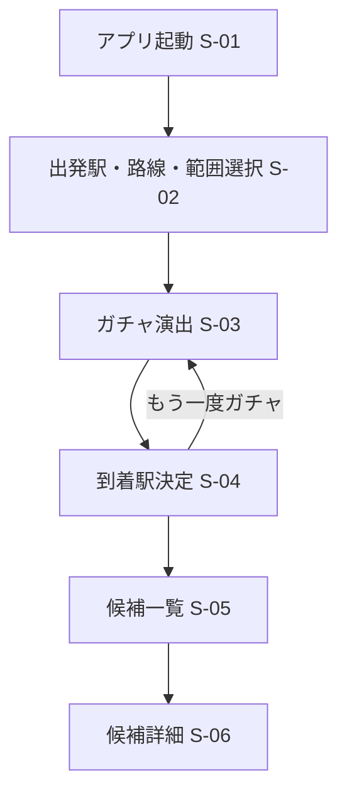
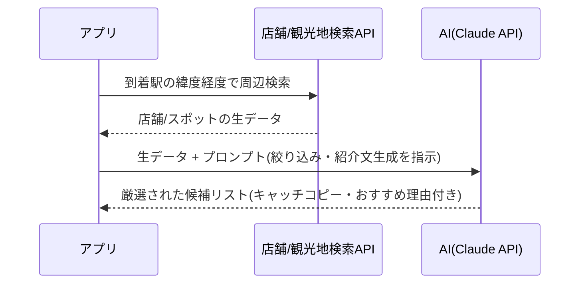
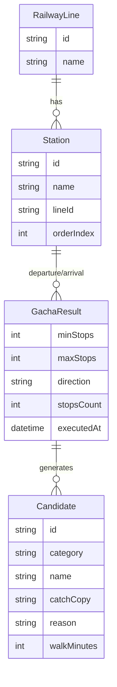

# ぶらりデートガチャ 全体設計書

> 文書名: ぶらりデートガチャ 全体設計書
> アプリ名: ぶらりデートガチャ ― 駅ガチャでめぐる、偶然のデートスポット
> バージョン: v1.0(初期構築時点)
> ステータス: 検討中

> 📝 詳細な要求仕様(画面仕様・AI連携仕様・データ設計・収益化モデル等)は、
> Notion「ぶらりデートガチャ 仕様書」で一元管理している。本書はそれをもとに、
> このリポジトリのコードベースと対応づけて要点をまとめたもの。仕様の変更は
> まずNotion側を更新し、本書は実装への影響がある範囲で追従する。

---

## 1. プロジェクト目標

### コンセプト
出発駅と路線を選ぶと、ランダムに「何駅隣まで行くか」が決まり、目的地の駅が判明する。
その駅周辺のグルメ・観光スポットをAIが候補として提案してくれる、デート先発見アプリ。

### コアバリュー
- **偶然性のデザイン**: 自分では選ばない行き先との出会いを演出する
- **意思決定コストの削減**: 「どこ行く?」を考える負担をなくす
- **AIによるパーソナライズ**: 機械的な候補ではなく、行きたくなる紹介文で提案する

### スコープ外(v1.0では対応しない)
- 対応路線・エリアの全国展開(初期は検証可能な範囲に限定。仕様書9章で要検討)
- カップルで同時にガチャを引く「二人で同期」機能などv2以降の拡張案(仕様書11章)

---

## 2. 対象ユーザー

| 属性 | ニーズ |
|---|---|
| 行き先を決めるのが面倒・マンネリ化したカップル | 「どこ行く?」の相談コストをなくしたい |
| 新しい発見を楽しみたいユーザー | 自分では選ばない街・店に偶然出会いたい |

**利用シーン**: 休日の予定が決まっていない時、いつもと違うデートがしたい時。

---

## 3. 主要機能

| No | 機能名 | 概要 | 優先度 |
|---|---|---|---|
| 1 | 出発駅・路線・駅数範囲選択 | 出発駅と路線を選択し、レンジスライダーで「何駅から何駅隣まで」を毎回自由に設定 | 必須 |
| 2 | 駅ガチャ(ランダム決定) | 選択路線内で「何駅隣まで行くか」をランダムに決定し、目的地駅を演出付きで表示 | 必須 |
| 3 | グルメ候補提案(AI) | 決定した駅周辺の飲食店をAIが要約・紹介文付きで複数件提案 | 必須 |
| 4 | 観光・お出かけ候補提案(AI) | 決定した駅周辺の観光地・公園などをAIが要約・紹介文付きで複数件提案 | 必須 |
| 5 | 再ガチャ(やり直し) | 結果が気に入らない場合に再抽選 | あったほうがよい |
| 6 | 候補の地図表示 | 店舗・スポットを地図上にピン表示 | あったほうがよい |
| 7 | 履歴機能 | 過去に出た駅・候補を振り返る | 任意 |
| 8 | お気に入り/保存 | 気になった候補を保存 | 任意 |

---

## 4. 画面一覧・画面遷移

デザイン(昭和レトロPOP、全8画面)は
[Figmaデザインファイル](https://www.figma.com/design/1zNLU0L3FyTI4IXodCTtog)を参照。

| ID | 画面名 | 実装(lib/presentation/pages) |
|---|---|---|
| S-01 | ホーム画面 | `home/home_page.dart` |
| S-02 | 出発駅・路線・駅数範囲選択画面 | `gacha/station_select_page.dart` |
| S-02b | 出発駅検索(サジェスト) | `gacha/station_search_sheet.dart` |
| S-03 | ガチャ演出画面 | `gacha/gacha_animation_page.dart` |
| S-04 | 到着駅決定画面 | `gacha/arrival_result_page.dart` |
| S-05 | 候補一覧画面(グルメ/観光タブ) | `gacha/candidate_list_page.dart` |
| S-06 | 候補詳細画面 | `gacha/candidate_detail_page.dart` |
| S-07 | 履歴画面 | `history/history_page.dart`(プレースホルダー) |
| S-08 | 設定画面 | `settings/settings_page.dart`(プレースホルダー) |



---

## 5. AI連携仕様

**利用目的**: 店舗・観光地検索APIから取得した生データを、AIが選定・要約し、ユーザーに響く
紹介文として提示する。



**ハルシネーション対策**: AIには外部APIで取得済みの実在データのみを渡し、店舗名や住所を
AIに新規生成させない。`domain/repositories/candidate_repository.dart`はこの境界を表す
インターフェースであり、現在の実装(`data/repositories/candidate_repository_impl.dart`)は
外部API/AI未接続のプレースホルダー。

---

## 6. データ設計



現在の実装は`domain/entities`にこれらをプレーンなDartクラスとして定義。永続化層(履歴・
お気に入り)は未着手(仕様書6.1 GachaHistory / Favorite)。

---

## 7. 外部連携・技術要件(候補)

| 用途 | 候補API | 状態 |
|---|---|---|
| 駅・路線データ | 駅すぱあとWebサービス / HeartRails Express / ODPT | 未接続(`data/datasources/local`のモックで代替) |
| 飲食店検索 | ホットペッパーグルメAPI / ぐるなびAPI / Google Places API | 未接続 |
| 観光地・公園検索 | Google Places API / じゃらん観光情報API | 未接続 |
| 候補生成AI | Claude API | 未接続 |
| 地図表示 | Google Maps SDK | 未接続 |

各APIの料金プラン・利用規約の確認は要調査(仕様書7.1)。

---

## 8. 非機能要件

- AI応答待ちを3秒以内に収めたい(裏側での先読み処理で対応)
- 駅マスタなど基本データはローカルキャッシュを検討(オフライン対応)
- 地図表示機能を使う場合は位置情報権限が必要
- 初期は日本語のみを想定

---

## 9. 収益化モデル

月額サブスク(使い放題型・初期価格300円)。目的はAI・外部APIコストをユーザーに負担して
もらい運営の持ち出しをゼロにすること。裏側のフェアユース上限(月30回目安)や価格見直しは
仕様書10章を参照。**アプリのコード上ではまだ課金導線は実装していない。**

---

## 10. アーキテクチャ(クリーンアーキテクチャ)

`lib/`はレイヤーごとに分割し、依存方向は `presentation → domain ← data` に固定する
(`domain`は`Flutter`・外部APIの実装詳細を知らない)。

```
lib/
├── app.dart                 # MaterialApp・ThemeDataの組み立て
├── main.dart                # エントリーポイント(ProviderScopeでラップ)
├── core/
│   └── constants/           # デザイントークン(docs/デザイントークン.md)
├── domain/
│   ├── entities/            # Station, RailwayLine, GachaResult, Candidate
│   ├── repositories/        # StationRepository, CandidateRepository(抽象)
│   └── usecases/            # RunGacha
├── data/
│   ├── datasources/local/   # モック駅データ(将来: 外部API実装に置き換え)
│   └── repositories/        # *RepositoryImpl
└── presentation/
    ├── pages/                # 画面(feature別: home / gacha / history / settings)
    ├── providers/            # Riverpod Provider / Notifier
    └── widgets/              # 共通Widget(ボトムナビ等)
```

状態管理はRiverpod。詳細な命名規則・実装ルールは[コード規約.md](コード規約.md)を参照。

---

## 11. 今後の検討事項・拡張案

**未解決(仕様書9章)**
- 到着駅が出発駅と同じ/未対応エリアだった場合の再抽選ロジック
- 対応路線・エリアの範囲(全国?特定都市圏のみ?)
- ユーザー登録の要否(ログイン無しで使えるようにするか)

**v2以降の拡張案(仕様書11章)**
- カップルで一緒にガチャを引ける「二人で同期」機能
- グルメ・観光以外のカテゴリ追加(カフェ、雑貨屋、写真スポットなど)
- 予算・ジャンルなど好み設定によるAI提案のパーソナライズ強化
- SNSシェア機能

これらは実装の優先度が固まり次第、GitHub Issueとして個別に起票する。

---

## 関連ドキュメント

- Notion: [ぶらりデートガチャ 仕様書](https://app.notion.com/p/3d45b8f5ffee81838c79dca575df9cc4) — 一次情報源
- Figma: [デザイン案(昭和レトロPOP・全8画面)](https://www.figma.com/design/1zNLU0L3FyTI4IXodCTtog)
- [デザイントークン](デザイントークン.md)
- [コード規約](コード規約.md)
- [環境とブランチ運用](環境とブランチ運用.md)
- [環境構築手順](環境構築手順.md)
- [テスト方針](テスト方針.md)
