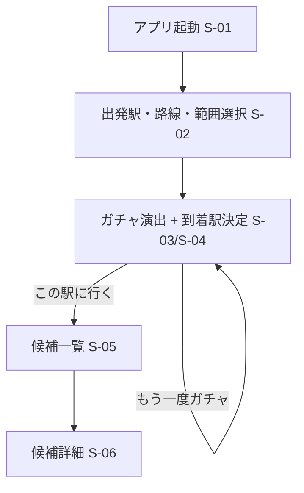
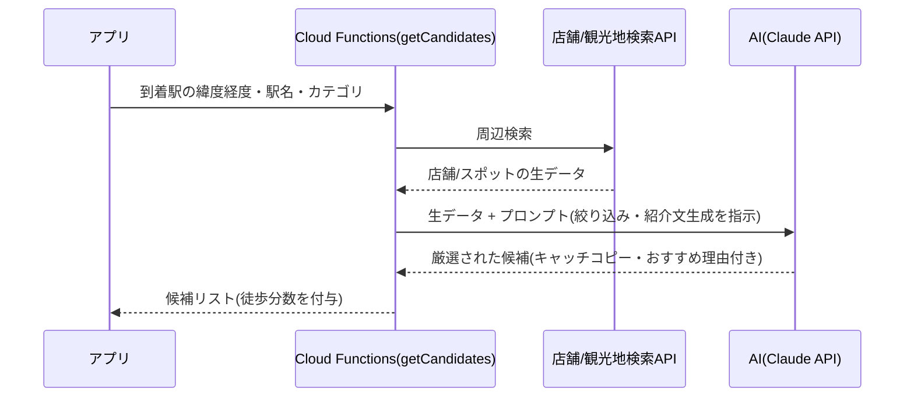
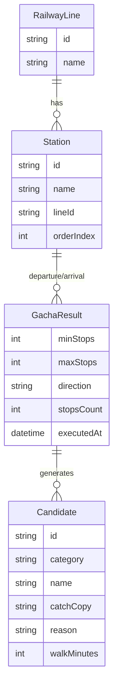

# ぶらりデートガチャ 全体設計書

> 文書名: ぶらりデートガチャ 全体設計書
> アプリ名: ぶらりデートガチャ ― 駅ガチャでめぐる、偶然のデートスポット
> バージョン: v1.0(初期構築時点)
> ステータス: 検討中

> 📝 詳細な要求仕様(画面仕様・AI連携仕様・データ設計・収益化モデル等)は、
> Notion「ぶらりデートガチャ 仕様書」で一元管理している。本書はそれをもとに、
> このリポジトリのコードベースと対応づけて要点をまとめたもの。仕様の変更は
> まずNotion側を更新し、本書は実装への影響がある範囲で追従する。

---

## 1. プロジェクト目標

### コンセプト
出発駅と路線を選ぶと、ランダムに「何駅隣まで行くか」が決まり、目的地の駅が判明する。
その駅周辺のグルメ・観光スポットをAIが候補として提案してくれる、デート先発見アプリ。

### コアバリュー
- **偶然性のデザイン**: 自分では選ばない行き先との出会いを演出する
- **意思決定コストの削減**: 「どこ行く?」を考える負担をなくす
- **AIによるパーソナライズ**: 機械的な候補ではなく、行きたくなる紹介文で提案する

### スコープ外(v1.0では対応しない)
- 対応路線・エリアの全国展開(初期は検証可能な範囲に限定。仕様書9章で要検討)
- カップルで同時にガチャを引く「二人で同期」機能などv2以降の拡張案(仕様書11章)

---

## 2. 対象ユーザー

| 属性 | ニーズ |
|---|---|
| 行き先を決めるのが面倒・マンネリ化したカップル | 「どこ行く?」の相談コストをなくしたい |
| 新しい発見を楽しみたいユーザー | 自分では選ばない街・店に偶然出会いたい |

**利用シーン**: 休日の予定が決まっていない時、いつもと違うデートがしたい時。

---

## 3. 主要機能

| No | 機能名 | 概要 | 優先度 |
|---|---|---|---|
| 1 | 出発駅・路線・駅数範囲選択 | 出発駅と路線を選択し、レンジスライダーで「何駅から何駅隣まで」を毎回自由に設定 | 必須 |
| 2 | 駅ガチャ(ランダム決定) | 選択路線内で「何駅隣まで行くか」をランダムに決定し、目的地駅を演出付きで表示 | 必須 |
| 3 | グルメ候補提案(AI) | 決定した駅周辺の飲食店をAIが要約・紹介文付きで複数件提案 | 必須 |
| 4 | 観光・お出かけ候補提案(AI) | 決定した駅周辺の観光地・公園などをAIが要約・紹介文付きで複数件提案 | 必須 |
| 5 | 再ガチャ(やり直し) | 結果が気に入らない場合に再抽選 | あったほうがよい |
| 6 | 候補の地図表示 | 店舗・スポットを地図上にピン表示 | あったほうがよい |
| 7 | 履歴機能 | 過去に出た駅・候補を振り返る | 任意 |
| 8 | お気に入り/保存 | 気になった候補を保存 | 任意 |

---

## 4. 画面一覧・画面遷移

デザイン(昭和レトロPOP、全8画面)は
[Figmaデザインファイル](https://www.figma.com/design/1zNLU0L3FyTI4IXodCTtog)を参照。

| ID | 画面名 | 実装(lib/presentation/pages) |
|---|---|---|
| S-01 | ホーム画面 | `home/home_page.dart` |
| S-02 | 出発駅・路線・駅数範囲選択画面 | `gacha/station_select_page.dart` |
| S-02b | 出発駅検索(サジェスト) | `gacha/station_search_sheet.dart` |
| S-03 | ガチャ演出画面 | `gacha/gacha_animation_page.dart` |
| S-04 | 到着駅決定 | 別画面にはせず、S-03(`gacha/gacha_animation_page.dart`)の中で、演出の確定後にその場で表示する(「この駅に行く」「もう一度ガチャ」) |
| S-05 | 候補一覧画面(グルメ/観光タブ) | `gacha/candidate_list_page.dart` |
| S-06 | 候補詳細画面 | `gacha/candidate_detail_page.dart` |
| S-07 | 履歴画面 | `history/history_page.dart`(ボトムナビの「履歴」) |
| - | お気に入り一覧 | `favorite/favorite_list_page.dart`(履歴画面の右上の星から遷移) |
| S-08 | 設定画面 | `settings/settings_page.dart`(ボトムナビの「設定」)。サブ画面: 効果音・AI提案の好み設定・アカウント・利用規約とお問い合わせ(いずれも`settings/`配下) |


```mermaid
flowchart TD
    A["アプリ起動 S-01"] --> B["出発駅・路線・範囲選択 S-02"]
    B --> C["ガチャ演出 + 到着駅決定 S-03/S-04"]
    C -- "この駅に行く" --> E["候補一覧 S-05"]
    E --> F["候補詳細 S-06"]
    C -- "もう一度ガチャ" --> C
```

---

## 5. AI連携仕様

**利用目的**: 店舗・観光地検索APIから取得した生データを、AIが選定・要約し、ユーザーに響く
紹介文として提示する。


```mermaid
sequenceDiagram
    participant App as アプリ
    participant Fn as Cloud Functions(getCandidates)
    participant PlaceAPI as 店舗/観光地検索API
    participant AI as AI(Claude API)

    App->>Fn: 到着駅の緯度経度・駅名・カテゴリ
    Fn->>PlaceAPI: 周辺検索
    PlaceAPI-->>Fn: 店舗/スポットの生データ
    Fn->>AI: 生データ + プロンプト(絞り込み・紹介文生成を指示)
    AI-->>Fn: 厳選された候補(キャッチコピー・おすすめ理由付き)
    Fn-->>App: 候補リスト(徒歩分数を付与)
```

アプリはAI・外部APIを直接呼ばず、バックエンド(`functions/`のCloud Functions)の
`getCandidates`だけを呼ぶ。APIキーはバックエンド側のSecretで管理する。

**ハルシネーション対策**: AIには外部APIで取得済みの実在データのみを渡し、店舗名や住所を
AIに新規生成させない(キャッチコピーとおすすめ理由だけを生成させる)。
`domain/repositories/candidate_repository.dart`はこの境界を表すインターフェースで、
実装は`data/repositories/candidate_repository_impl.dart`(Cloud Functionsの呼び出し)。

**現在の実装**: グルメはホットペッパーグルメ、観光はFoursquare Placesから取得し、
候補の生成には`claude-haiku-4-5`を使う(`functions/src/`の`gourmet.ts` / `sightseeing.ts` /
`ai.ts`)。候補の取得は、グルメ/観光のカテゴリごとに1回のAI呼び出しになる。

---

## 6. データ設計


```mermaid
erDiagram
    RailwayLine ||--o{ Station : "has"
    Station ||--o{ GachaResult : "departure/arrival"
    GachaResult ||--o{ Candidate : "generates"

    RailwayLine {
        string id
        string name
    }
    Station {
        string id
        string name
        string lineId
        int orderIndex
    }
    GachaResult {
        int minStops
        int maxStops
        string direction
        int stopsCount
        datetime executedAt
    }
    Candidate {
        string id
        string category
        string name
        string catchCopy
        string reason
        int walkMinutes
    }
```

現在の実装は`domain/entities`にこれらをプレーンなDartクラスとして定義。これに加えて、
履歴用の`GachaHistoryEntry`(表示に必要な項目だけを持つ保存専用の軽量版)と
お気に入り用の`Favorite`(保存時点の候補のスナップショット)がある(仕様書6.1 GachaHistory /
Favorite)。

**永続化**: 履歴とお気に入りはFirestoreに保存する(`users/{uid}/history`、
`users/{uid}/favorites`。`data/datasources/cloud/`)。`uid`は起動時の匿名認証
(`bootstrap.dart`)で得た値で、ユーザーにログインは求めない。

---

## 7. 外部連携・技術要件(候補)

| 用途 | 採用 | 状態 |
|---|---|---|
| 駅・路線データ | HeartRails Express | 接続済み(`data/datasources/remote/heartrails_station_data_source.dart`) |
| 飲食店検索 | ホットペッパーグルメAPI | 接続済み(Cloud Functions。候補詳細にクレジットを表示) |
| 観光地・公園検索 | Foursquare Places API | 接続済み(Cloud Functions) |
| 候補生成AI | Claude API(`claude-haiku-4-5`) | 接続済み(Cloud Functions) |
| 地図表示 | `flutter_map` + CARTOのベースマップタイル | 実装済み(候補詳細。「経路案内を開く」で外部の地図アプリへ) |
| 認証・保存・バックエンド | Firebase(匿名認証・Firestore・Cloud Functions) | 接続済み |

各APIの料金プラン・利用規約の確認は要調査(仕様書7.1)。

---

## 8. 非機能要件

- AI応答待ちを3秒以内に収めたい(裏側での先読み処理で対応)
- 駅マスタなど基本データはローカルキャッシュを検討(オフライン対応)
- 地図表示機能を使う場合は位置情報権限が必要
- 初期は日本語のみを想定

---

## 9. 収益化モデル

月額サブスク(使い放題型・初期価格300円)。目的はAI・外部APIコストをユーザーに負担して
もらい運営の持ち出しをゼロにすること。裏側のフェアユース上限(月30回目安)や価格見直しは
仕様書10章を参照。**アプリのコード上ではまだ課金導線は実装していない。**(Issue #10)

**現在の実装**: バックエンドに、1ユーザー(匿名認証のuid)あたり累計10回までの無料枠がある
(`functions/src/fairUse.ts`)。1回は「1回のガチャ」で、そのガチャのグルメ・観光の両方の取得を
含む(アプリが送る`gachaId`で、同じガチャの別カテゴリを数えない。記録は
`users/{uid}/gachaUsage/{gachaId}`)。候補の取得に失敗したときは消費した回数を戻す。月ごとの
フェアユース上限(課金後の月30回目安。超えたら追加課金で継続利用できる。追加分の価格・単位は
未定)は未実装。

無料枠(累計10回)は月ごとに回復しない。使い切ると、「継続利用にはアカウント登録と課金が
必要です」と案内し、課金しないと使えない。つまり、登録なし(匿名)で使い始められ、
無料枠を使い切った時点でアカウント登録と課金を求める方針(登録・課金の導線自体は未実装。
Issue #10)。

---

## 10. アーキテクチャ(クリーンアーキテクチャ)

`lib/`はレイヤーごとに分割し、依存方向は `presentation → domain ← data` に固定する
(`domain`は`Flutter`・外部APIの実装詳細を知らない)。

```
lib/
├── app.dart                 # MaterialApp・ThemeDataの組み立て
├── bootstrap.dart           # 共通の起動処理(Flavor設定・Firebase初期化・匿名認証)
├── main_dev.dart / main_stg.dart / main_prod.dart  # Flavorごとのエントリーポイント
├── main.dart                # 引数なし起動時のデフォルト(devに委譲)
├── core/
│   ├── config/              # Flavor
│   └── constants/           # デザイントークン(docs/デザイントークン.md)
├── domain/
│   ├── entities/            # Station, RailwayLine, GachaResult, GachaHistoryEntry, Candidate, Favorite
│   ├── repositories/        # Station / Candidate / GachaHistory / Favorite の各Repository(抽象)
│   └── usecases/            # RunGacha
├── data/
│   ├── datasources/
│   │   ├── remote/          # HeartRails Express(駅・路線)
│   │   └── cloud/           # Firestore(履歴・お気に入り)
│   └── repositories/        # *RepositoryImpl(候補はCloud Functionsを呼ぶ)
└── presentation/
    ├── pages/                # 画面(feature別: home / gacha / history / favorite / settings)
    ├── providers/            # Riverpod Provider / Notifier
    └── widgets/              # 共通Widget(ボトムナビ、電車・駅・二人のイラスト)

functions/                    # バックエンド(Cloud Functions。候補取得・AI連携・無料枠管理)
```

状態管理はRiverpod。詳細な命名規則・実装ルールは[コード規約.md](コード規約.md)を参照。

---

## 11. 今後の検討事項・拡張案

**未解決(仕様書9章)**
- 到着駅が出発駅と同じ/未対応エリアだった場合の再抽選ロジック
- 対応路線・エリアの範囲(全国?特定都市圏のみ?)
- ~~ユーザー登録の要否~~ → **登録なし(匿名認証)で使い始められ、無料枠(累計10回)を
  使い切った時点でアカウント登録と課金を求める**と決定。登録は、匿名アカウントを登録
  アカウントに変換する形で追加する(それまでの履歴・お気に入りを引き継げる)。
  機種変更での引き継ぎ、iOS/Androidをまたぐ利用、二人で同期(v2)も、この登録で対応できる

**v2以降の拡張案(仕様書11章)**
- カップルで一緒にガチャを引ける「二人で同期」機能
- グルメ・観光以外のカテゴリ追加(カフェ、雑貨屋、写真スポットなど)
- 予算・ジャンルなど好み設定によるAI提案のパーソナライズ強化
- SNSシェア機能

これらは実装の優先度が固まり次第、GitHub Issueとして個別に起票する。

---

## 関連ドキュメント

- Notion: [ぶらりデートガチャ 仕様書](https://app.notion.com/p/3d45b8f5ffee81838c79dca575df9cc4) — 一次情報源
- Figma: [デザイン案(昭和レトロPOP・全8画面)](https://www.figma.com/design/1zNLU0L3FyTI4IXodCTtog)
- [デザイントークン](デザイントークン.md)
- [コード規約](コード規約.md)
- [環境とブランチ運用](環境とブランチ運用.md)
- [環境構築手順](環境構築手順.md)
- [テスト方針](テスト方針.md)
